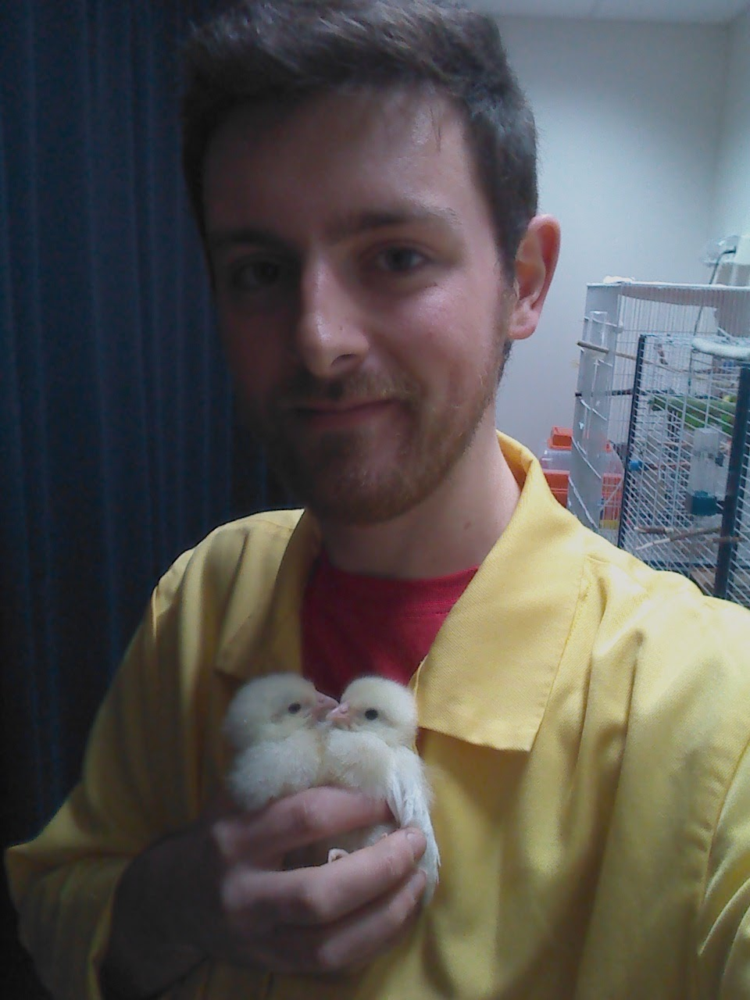

# Better Python: Introduction

RSE Team, University of Sheffield, September 2021

# Acknowledgements

Based on ["Best Practises in Software Engineering"](https://gitlab.com/milliams/software_engineering_best_practices) by Matt Williams.

# Thank you!

Thanks for coming - this course is under development and we'd like feedback.

# About Bob

{ height=256px }

Mix of software engineering and research experience.

# About David

{ height=256px }

Former chicken/physics researcher, now research software engineer.

# RSE at Sheffield

{ height=256px }

13 RSEs, 35 projects / year worth ~£11m total

# Main Topics

1. documentation
2. licensing
3. testing

# Delivery

Mix of short presentations and self directed exercises.

# Principles are general

We're doing this in `Python`. C, C++, R, Fortran, Julia, Go and Rust have their own specific tools and techniques.

# Running order

1. Presentation - why bother with documentation?
2. Exercise - documentation.
3. Presentation - software licensing.
4. Presentation - why bother with testing?
5. Exercise - testing.
6. Check in!
7. Exercise - fixtures.
8. Close.
