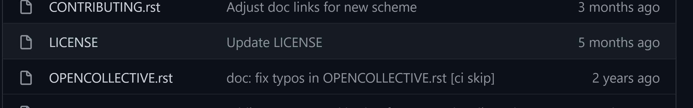
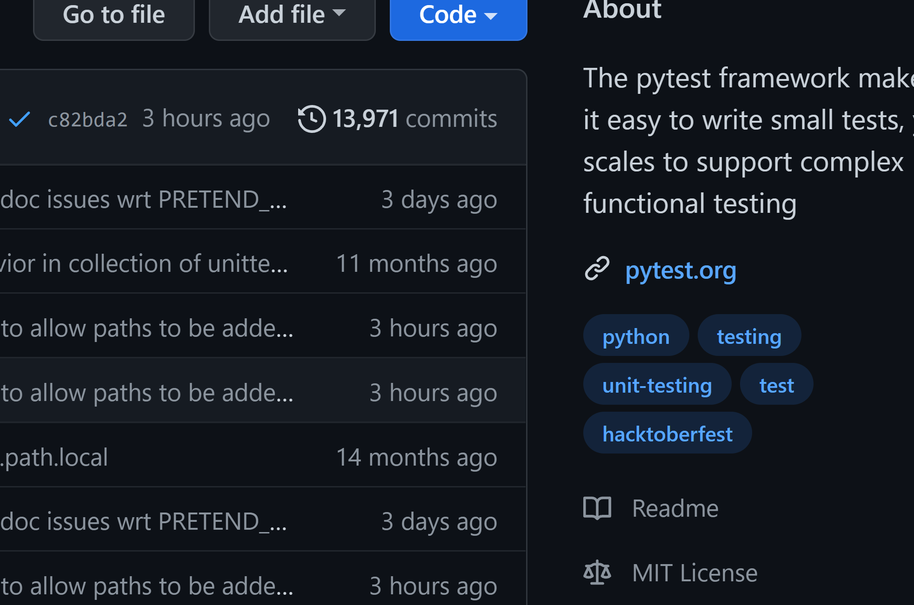

# Licensing your code

Why, when and how (draft guidance, we're not lawyers). [More information](https://milliams.gitlab.io/software_engineering_best_practices/Licensing.html).

# Copyright

[Berne Convention](https://en.wikipedia.org/wiki/Berne_Convention) of 1886: Copyright is immediately bestowed upon a work the moment it is created, without requiring any registration.

# License

Relaxes conditions imposed by copyright in specific ways.

# Examples of open source

::: incremental

* Linux
* Firefox
* Python
* VSCode (Microsoft)
* PyTorch (Facebook)

:::

# Motivation: FAIR Priniciples

{ height=300px }

The Turing Way project illustration by Scriberia. Used under a CC-BY 4.0 licence. DOI: 10.5281/zenodo.3332807.

# FAIR4RS: We envision a world where:

* All research is reproducible
* All research software is open
* All research software is usable by others (for their own research)
* All contributors to research software are recognized for their work
* All research software is sustained as long as it is useful
* All research software is high-quality and robust

[Katz et al. 2021](https://arxiv.org/ftp/arxiv/papers/2101/2101.10883.pdf)

# [Four freedoms (abridged)](https://www.gnu.org/philosophy/free-sw.en.html)

- The freedom to run the program as you wish, for any purpose (freedom 0).
- The freedom to study how the program works, and change it so it does your computing as you wish (freedom 1).
- The freedom to redistribute copies so you can help others (freedom 2).
- The freedom to distribute copies of your modified versions to others (freedom 3).

# Reasons **not** to make code open

::: incremental

- Wait for publication
- Want to commercialise
- Don't have permission (e.g. co-authors / collaborations)
- Shyness / fear

:::

# Wait for publication...

Fear of scoop by a competing group.

::: incremental

- Open code:
  - Faster impact
  - More eyes, less bugs

:::

# Want to commercialise...

Open source software is compatible with capitalism.

Explore options for spin outs / licensing early (*Research Services Impact & IP Team*).

# Don't have permission...

::: incremental

- Ask for permission from co-authors.
- Check what project-specific restrictions are in place.

:::

# Shyness / fear

::: incremental

- "My code isn't good enough."
- "My code isn't valuable."

:::

# How to open source

::: incremental

- Choose a licence, agreed by everyone on the project.
- Put the licence text in a file alongside your code.
- Publish your code somewhere such as GitHub or GitLab.
- Reference specific versions using [ORDA](https://orda.shef.ac.uk/), [Zenodo](https://zenodo.org/) or equivalent.

:::

# Choose a license

- "Copyleft" e.g. [GPL3](https://choosealicense.com/licenses/gpl-3.0/) - better for academic collaboration
- More permissive e.g. [MIT](https://choosealicense.com/licenses/mit/) - better for private sector collaboration

[choosealicence.com](choosealicence.com)

*Presenter follow links.*

# Apply the licence

- Most licenses require a single file like `LICENSE` or `LICENSE.txt`.
- Some licences advise that you should put a message at the top of every file.

# Publish

{ height=512px }

# University of Sheffield advice

- [Research Software Engineering team](https://rse.shef.ac.uk/)
- [Library, Research Data Management](https://www.sheffield.ac.uk/library/rdm)
- [Research Services Impact & IP Team](https://www.sheffield.ac.uk/rs/impact)
